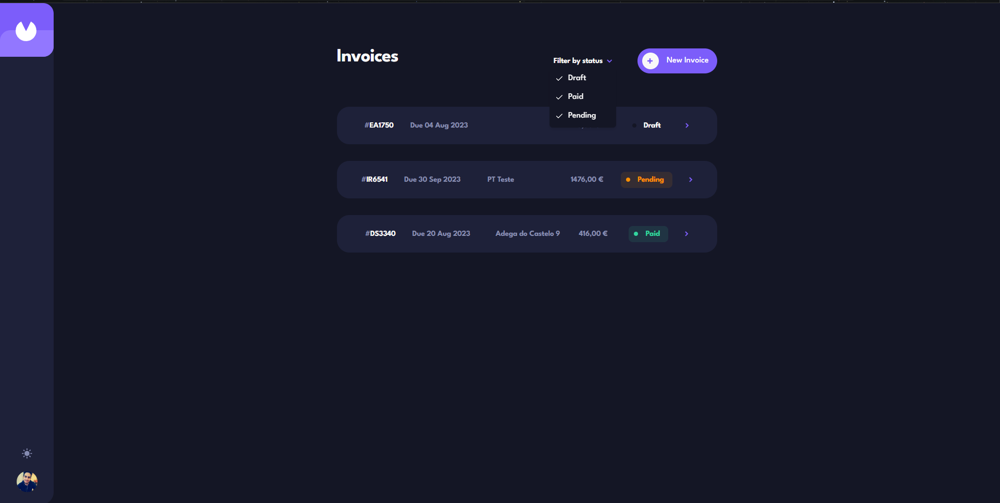
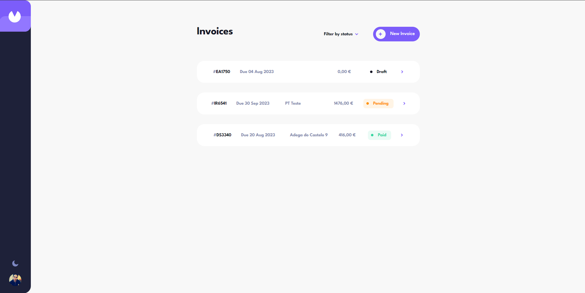

# Frontend Mentor - Invoice app solution

This is a solution to the [Invoice app challenge on Frontend Mentor](https://www.frontendmentor.io/challenges/invoice-app-i7KaLTQjl). Frontend Mentor challenges help you improve your coding skills by building realistic projects. 

## Table of contents

- [Overview](#overview)
  - [The challenge](#the-challenge)
  - [Screenshot](#screenshot)
  - [Links](#links)
- [My process](#my-process)
  - [Built with](#built-with)
  - [What I learned](#what-i-learned)
  - [Continued development](#continued-development)
- [Author](#author)
- [Acknowledgments](#acknowledgments)

## Overview

### The challenge

Users should be able to:

- View the optimal layout for the app depending on their device's screen size
- See hover states for all interactive elements on the page
- Create, read, update, and delete invoices
- Receive form validations when trying to create/edit an invoice
- Save draft invoices, and mark pending invoices as paid
- Filter invoices by status (draft/pending/paid)
- Toggle light and dark mode

### Screenshot

### Links

- Solution URL: [Github](https://github.com/joaopmendes/invoice-app)
- Live Site URL: [Vercel](https://invoice-app-smokey.vercel.app/)

## My process

### Built with

- Semantic HTML5 markup
- CSS custom properties
- Flexbox
- CSS Grid
- Mobile-first workflow
- [React](https://reactjs.org/) - JS library
- [Next.js](https://nextjs.org/) - React framework
- [Tailwind CSS](https://tailwindcss.com/) - Tailwind css
- [React Hook Form](https://react-hook-form.com/) - React Hook Form
- [Shadcn](https://ui.shadcn.com/) - Shadcn UI
- [Prisma](https://www.prisma.io/) - Prisma ORM
- [MySQL](https://www.mysql.com/) - MySQL Database

### What I learned

I further improved my knowledge of React, Next.js and Tailwind CSS and I also learned how to use Prisma ORM with MySQL Database.

### Continued development

After this project I recon I need to improve my knowledge and productivity with CSS which is the area where I am having some trouble

## Author
- Frontend Mentor - [@joaopmendes](https://www.frontendmentor.io/profile/joaopmendes)

## Acknowledgments
Thank you Frontend Mentor for this challenge and for the amazing platform you have created to help us improve our skills.
